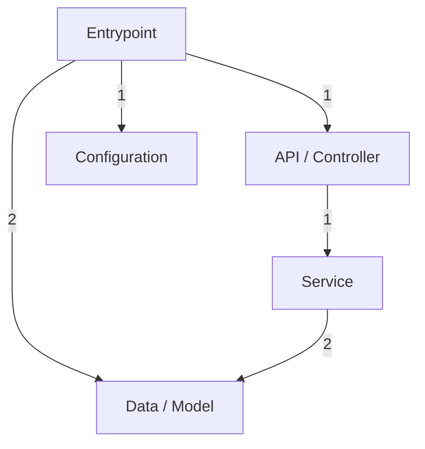
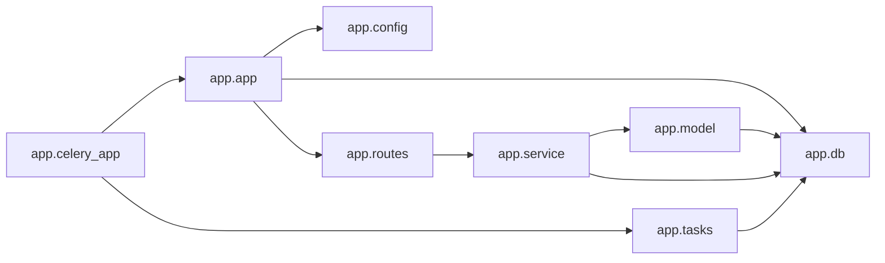

# Architecture

_Project: email-notification_

This document is generated from the Repository Knowledge Graph
(`repository_knowledge.json`) built by deterministic source analysis.

## Overview

- Primary language: Python
- Detected frameworks: Flask, SQLAlchemy, Flask-SQLAlchemy, Flask-Migrate
- Architecture pattern (heuristic): Monolith

## Code Structure

- Modules parsed: 10
- Functions: 12 (0 async)
- Classes: 2 (methods: 0)
- Import statements: 32
- External packages: 11

## Layers

Modules are grouped into architectural layers inferred from naming conventions.

| Layer | Modules |
|---|---|
| API / Controller | 1 |
| Service | 1 |
| Data / Model | 2 |
| Configuration | 1 |
| Entrypoint | 3 |
| Other | 2 |

### Layer interaction

## Module Dependencies

## Circular Dependencies

None detected. Module dependencies form an acyclic graph.

## APIs

Detected web frameworks: Flask.
See `API_REFERENCE.md` for the full endpoint list.

---
_Generated by Repository Intelligence (Phase 2) from `repository_knowledge.json`._
