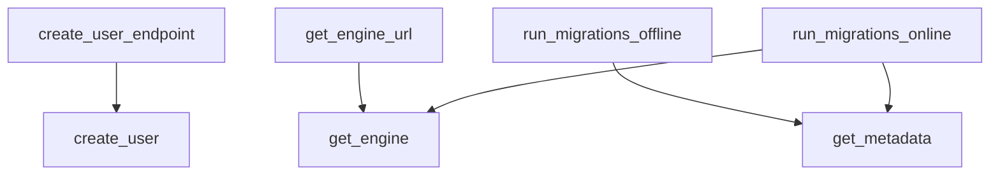

# Call Graph

_Project: email-notification_

Caller/callee relationships resolved deterministically by name from the parsed
source models.

## Summary

- Functions/methods: 12
- Call relationships: 5
- Entry points (uncalled): 4

## Diagram

## Relationships

- `app.routes.create_user_endpoint` -> `app.service.create_user`
- `migrations.env.get_engine_url` -> `migrations.env.get_engine`
- `migrations.env.run_migrations_offline` -> `migrations.env.get_metadata`
- `migrations.env.run_migrations_online` -> `migrations.env.get_engine`
- `migrations.env.run_migrations_online` -> `migrations.env.get_metadata`

---
_Generated by Repository Intelligence (Phase 2) from `repository_knowledge.json`._
