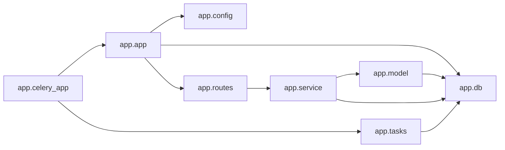

# Module Dependency Graph

_Project: email-notification_

Internal modules: 10. Dependencies: 10.

## Diagram

## Modules

| Module | Layer | Depends on |
|---|---|---|
| `app.app` | Entrypoint | 3 |
| `app.celery_app` | Entrypoint | 2 |
| `app.config` | Configuration | 0 |
| `app.db` | Data / Model | 0 |
| `app.model` | Data / Model | 1 |
| `app.routes` | API / Controller | 1 |
| `app.service` | Service | 2 |
| `app.tasks` | Entrypoint | 1 |
| `migrations.env` | Other | 0 |
| `migrations.versions.0cdbee0f0fff_create_users` | Other | 0 |

## External Packages

`alembic`, `celery`, `dotenv`, `flask`, `flask_mail`, `flask_migrate`, `flask_sqlalchemy`, `logging`, `os`, `sqlalchemy`, `uuid`

## Circular Dependencies

None detected. Module dependencies form an acyclic graph.

---
_Generated by Repository Intelligence (Phase 2) from `repository_knowledge.json`._
